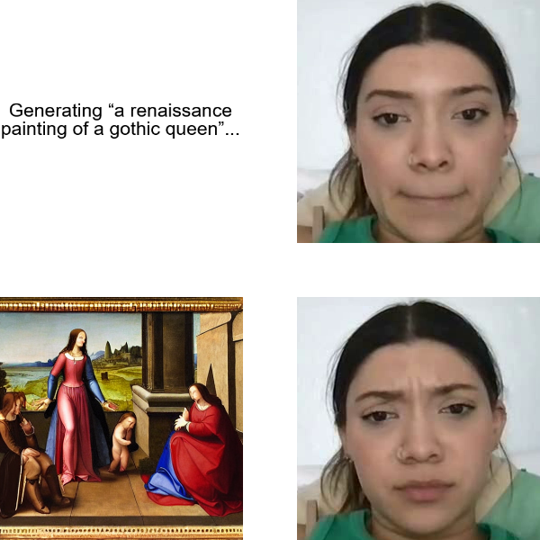
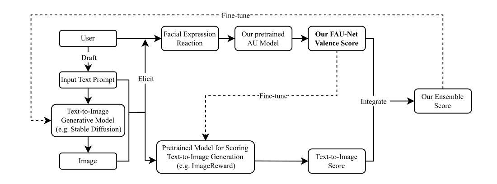

# FERGI (Facial Expression Reaction to Generated Images)

    

   <strong>An example of AU4 (brow lowerer) activation in response to a low-quality image generation</strong>

    

   <strong>A flow chart summarizing the pipeline our paper proposed</strong>

Researchers have proposed to use data of human preference feedback to fine-tune text-to-image generative models. However, the scalability of human feedback collection has been limited by its reliance on manual annotation. Therefore, we develop and test a method to automatically annotate user preferences from their spontaneous facial expression reaction to the generated images. We collect a dataset of Facial Expression Reaction to Generated Images (FERGI) and show that the activations of multiple facial action units (AUs) are highly correlated with user evaluations of the generated images. Specifically, AU4 (brow lowerer) is most consistently reflective of negative evaluations of the generated image. This can be useful in two ways. Firstly, we can automatically annotate user preferences between image pairs with substantial difference in AU4 responses to them with an accuracy significantly outperforming state-of-the-art scoring models. Secondly, directly integrating the AU4 responses with the scoring models improves their consistency with human preferences. Additionally, the AU4 response best reflects the user's evaluation of the image fidelity, making it complementary to the state-of-the-art scoring models, which are generally better at reflecting image-text alignment. Finally, this method of automatic annotation with facial expression analysis we demonstrated can be potentially generalized to other generation tasks.

# Getting Started
## Dependencies
The primary dependencies include NumPy, pandas, SciPy, Matplotlib, seaborn, OpenCV, MediaPipe, PyTorch, Torchvision, Trasnformers, [CLIP](https://github.com/openai/CLIP), [BLIP](https://github.com/salesforce/BLIP),  [ImageReward](https://github.com/THUDM/ImageReward), and [HPS v2](https://github.com/tgxs002/HPSv2).

## Datasets
The datasets for training the AU models [DISFA](http://mohammadmahoor.com/disfa/) and [DISFA+](http://mohammadmahoor.com/disfa/) are supposed to be stored at "../FER_datasets/DISFA" and "../FER_datasets/DISFAPlus" respectively (paths specificed in config.py).

FERGI dataset is available for research purposes. Please request it by filling out this [form](https://forms.gle/ja1DUNumBnGSkMMC8). The dataset is supposed to be stored in the "data" folder. Although the raw dataset is not provided in the github repository, the processed facial features of the videos in the dataset has already been provided in the "data" folder.

## Pretrained Models
Multiple pretrained models are used in our model training and analysis. They need to be downloaded from the following links and stored in the "pretrained_models" folder.

The face recognition model used as the pretrained model to fine-tune for training the AU recognition model can be downloaded [here](https://onedrive.live.com/?authkey=%21AFZjr283nwZHqbA&cid=4A83B6B633B029CC&id=4A83B6B633B029CC%215650&parId=4A83B6B633B029CC%215581&o=OneUp). The download link is provided in the [github repository of InsightFace](https://github.com/deepinsight/insightface/tree/master/recognition/arcface_torch#model-zoo). It is supposed to be renamed as "glint360k_cosface_r50_fp16_0.1.pth" and stored in the "pretrained_models" folder after being downloaded.

The face detection model can be downloaded [here](https://storage.googleapis.com/mediapipe-models/face_detector/blaze_face_short_range/float16/latest/blaze_face_short_range.tflite). The download link is provided in the [official document of MediaPipe](https://developers.google.com/mediapipe/solutions/vision/face_detector).

The facial landmark detection model can be downloaded [here](https://drive.google.com/file/d/1T8J73UTcB25BEJ_ObAJczCkyGKW5VaeY/view). The download link is provided in the [github repository of pytorch_face_landmark](https://github.com/cunjian/pytorch_face_landmark).
## AU Datasets Preprocessing
Run preprocess_DISFA.py and preprocess_DISFAPlus.py for preprocessing the AU datasets.

## AU Model Training
Run DISFAwithPlus_train_model.py for the training AU recognition model. The trained AU models will be saved in the folder "AU_models". The AU model used for following analysis can also be downloaded [here](https://drive.google.com/file/d/14Y5h-l6FurSdYBhhH4MaJo7VXsbIEhyC/view?usp=drive_link). <strong>Note that this model is trained on DISFA and DISFA+ and thus should be used for research purposes only.</strong>

## Facial Feature Processing
Run clips_facial_process.py for processing the facial features of the videos in the FERGI dataset. The results from our model has already been provided in the "data" folder.

## FERGI Dataset Preprocessing
Run preprocess_image_data.py, preprocess_baseline_data.py, and preprocess_reaction_data.py for preprocessing the data of generated images, the data of baseline videos, and the data of reaction videos in the FERGI dataset respectively. The results are saved in the "preparation" folder.

## Participant Exclusion
Run filter_participants_based_on_AU4.py for excluding participants with unreliable, unstable AU4 estimation in following classification (Section 5.2 in the paper). The result is saved in the "preparation" folder.

## Image Preference Classification
Run image_preference_binary_classification_based_on_ranking.py for binary classification of image preferences (Section 5.2 in the paper). The results are saved in the "results" folder.

## Result Analysis
Run result_analysis.ipynb for analyzing and visualizing the results (Sections 5.1, 5.2, and 5.3 in the paper). The visualizations are saved in the "figures" folder.
